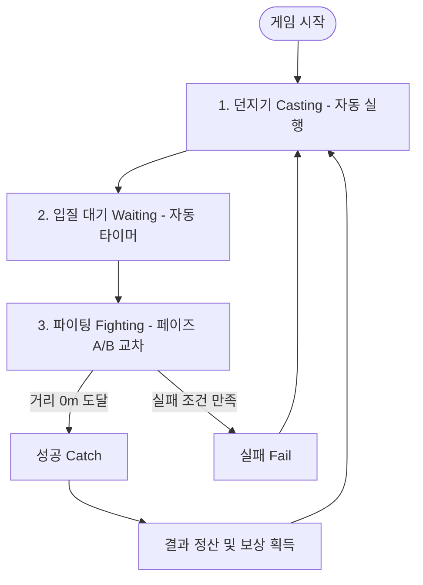

# 낚시 게임 "FishBattle" 기획서 (v1.0)

본 문서는 **FishBattle**의 핵심 게임 메커니즘과 시스템 규칙을 정의합니다. 플레이어의 조작 피로도를 최소화하면서도, 물고기와의 치열한 파이팅 재미를 극대화하는 것을 목표로 합니다.

---

## 1. 게임 개요 (Game Overview)

* **게임명**: FishBattle (피시배틀)
* **장르**: 2D 캐주얼 아케이드 낚시 & 배틀 게임
* **플랫폼**: Android (모바일 APK) & Windows (PC 테스트용)
* **빌드 방식**: **Pygame + Briefcase (BeeWare)** 기반 (Windows에서 가상 리눅스 없이 직접 빌드)
* **핵심 타겟**: 한 손으로 간편하게 즐기며 짜릿한 타이밍/드래그 손맛을 느끼고 싶은 캐주얼 게이머.
* **화면 레이아웃**:
  - **상단 47% (약 0px ~ 300px)**: 낚시 캐릭터 연출 및 배경 영역 (낚시 모션, 바다/호수 파도 등 비주얼 요소)
  - **하단 53% (약 300px ~ 640px)**: 조작 및 UI 영역 (리듬 파이팅 구역, 상점, 아이템 인벤토리 등 배치)

---

## 2. 핵심 게임 루프 (Core Game Loop)

모든 게임 과정은 물고기 낚시의 긴장감(파이팅)에 집중하기 위해 캐스팅과 대기는 자동화되어 있으며, 성공/실패 여부에 따라 즉시 다음 루프로 순환됩니다.



---

## 3. 핵심 시스템 상세 기획 (Core Systems)

### 3.1. 던지기 (Casting) : 자동화 및 확률 루프
조작 피로도를 최소화하고 핵심 플레이(파이팅)로의 빠른 진입을 돕기 위해 던지기 동작은 자동화되어 있습니다.

* **진입 규칙**: 게임 시작 시 자동으로 첫 던지기가 실행됩니다. 이후 성공(Catch) 혹은 실패(Fail)로 판이 종료되면, 별도 터치 없이 **즉시 자동으로 다음 던지기가 실행**됩니다.
* **희귀도 결정 공식**:
  $$최종\ 확률 = \max(\text{지역 기본 확률} + \text{아이템 스펙},\ \text{최저 보장 확률})$
* **세부 규칙**:
  - **지역 규칙**: 각 지역(Map)별로 고유한 `[기본 희귀도 확률]`과 `[최저 보장 확률 (Floor)]`이 설정되어 있습니다.
  - **장비 보정**: 장착한 낚싯대, 미끼 등의 아이템 스펙이 `지역 기본 확률`에 더해져 최종 희귀도 확률을 보정합니다.
  - **안전 장치**: 장비 스펙이 매우 낮거나 디버프를 받더라도, 최종 확률은 해당 지역의 `최저 보장 확률` 미만으로 절대 떨어지지 않습니다.

---

### 3.2. 입질 기다리기 (Waiting) : 시간 단축 루프
대기 구간 역시 플레이어 조작 없이 자동으로 파이팅 단계로 전환됩니다.

* **대기 시간 계산 매커니즘**:
  - 지역마다 고유한 `Min_Time(최소 대기 초)`과 `Max_Time(최대 대기 초)` 범위가 설정되어 있습니다.
  - **아이템 영향**: 상위 장비(스펙)는 **오직 `Max_Time`만 감소**시킵니다. 즉, 플레이어가 최악으로 오래 기다려야 하는 상황(Worst Case)을 방지합니다.
  - **시간 하한선 (최대 효율 제한)**: 장비 스펙이 아무리 높더라도 `Max_Time`은 `Min_Time + α` 수준의 하한선 이하로 감소하지 않으며, 결코 `Min_Time` 이하로 떨어질 수 없습니다. (낚시 특유의 최소 대기 감성 유지)
* **실행**:
  1. 장비 스펙이 반영된 수정된 `Max_Time`을 계산합니다.
  2. 최종 범위 `[Min_Time ~ 수정된 Max_Time]` 사이에서 랜덤 난수(초)를 추출합니다.
  3. 해당 시간이 경과하면 **파이팅 단계로 자동 진입**합니다.

---

### 3.3. 파이팅 (Fighting) : 2개 페이즈의 무한 교차 (핵심 손맛)
물고기를 최종 포획할 때까지 **[페이즈 A: 리듬 타겟] ➔ [페이즈 B: 제스처 홀드]**가 불규칙하게 반복되며 긴장감을 유지하는 핵심 루프입니다.

#### 🔄 페이즈 A: 리듬 타겟 터치 (물고기 체력 깎기)
화면에 나타나는 타겟을 타이밍에 맞춰 터치하여 물고기의 힘(체력)을 약화시키는 페이즈입니다.

```
+------------------------------------------+
|            [파이팅 영역 (전체)]            |
|                                          |
|         +-----------------------+        |
|         |     타겟 박스         |        |
|         |   (무작위 생성)       |        |
|         |    ( ◎ 터치! )        |        |
|         +-----------------------+        |
|                                          |
+------------------------------------------+
```

* **매커니즘**: 사각 파이팅 영역 내부의 무작위 위치에 '타겟 박스'가 생성됩니다. 플레이어는 타이밍 표시(축소되는 링 등)에 맞춰 정확히 터치해야 합니다.
* **판정 및 효과 (4단계)**:
  - **Miss**: 타이밍을 놓치거나 잘못 터치함. 물고기 체력 감소가 없으며, 누적 시 실패 패널티가 적용됩니다.
  - **Good / Very Good / Special**: 타이밍의 정확도에 따라 물고기의 체력(HP)을 차등적으로 감소시킵니다.
* **물고기 크기(Size) 연동 공식**:
  - 물고기마다 고유한 크기 범위 `[Min_Size ~ Max_Size]`가 존재합니다.
  - 이 페이즈에서 Miss를 최소화하고 **Special 판정을 많이 받아 체력을 빠르게 대량으로 깎아낼수록**, 최종 포획 시 크기가 `Max_Size`에 가깝게 보정(상승)됩니다. 반대로 판정이 나쁘면 `Min_Size`에 가까운 작은 개체가 잡힙니다.

#### 🔄 페이즈 B: 자동 드로잉 및 타이밍 릴리즈 (릴 텐션 낚아채기)
* **매커니즘**:
  - 리듬 페이즈가 끝나면 하단 영역 중앙에서 특정 방향(상, 하, 좌, 우 중 하나)으로 가이드 화살표가 **자동으로 천천히 그려지기 시작(Auto Drawing)**합니다.
  - 화살표의 최대 길이는 매 배틀마다 **랜덤(80px ~ 180px)하게 결정**되어 다채로운 시각적 긴장감을 줍니다.
  - 화살표가 완전히 끝부분에 도달하는 찰나, 끝에 **'완료 점 (Release Dot)'**이 탁 나타납니다.
* **조작 및 판정**:
  - **드래그 홀드 조작**: 플레이어는 화살표가 자동으로 그려지는 동안, 해당 방향으로 **마우스(또는 손가락) 드래그를 유지(Hold)하고 대기**합니다.
  - **해제(Release) 타이밍**: 화살표 끝에 **'완료 점'**이 생기는 찰나(오차 $\pm0.15$초)에 마우스(또는 손가락)를 탁 **놓아야(Release)** 성공합니다.
  - **판정 분류**:
    - **Early Release**: 화살표 드로잉이 다 끝나지 않고 점이 생기기 전에 미리 손을 뗀 경우 (실패, 거리 도망 패널티)
    - **Perfect Release**: 완료 점이 나타난 직후 $\pm0.15$초 이내에 타이밍을 맞춰 놓은 경우 (성공, 큰 거리 단축 보너스)
    - **Late Release**: 점이 나타났으나 한참 지나서 손을 뗀 경우 (실패, 거리 도망 패널티)
    - **Hold Interrupted**: 화살표가 차오르는 중에 아예 입력(드래그)을 하지 않았거나, 잘못된 방향을 짚었거나, 유지하지 못하고 이탈한 경우 (실패, 줄 풀림)
* **효과**: 올바르게 유지 및 떼기에 성공하면 물고기와의 거리가 실시간 및 보너스 수치로 크게 줄어들며 파이팅을 유리하게 이끕니다.

#### 🏁 종료 조건
* **성공 (Catch)**: 두 페이즈를 교차 반복하여 물고기와의 최종 거리(m)를 0으로 만들면 즉시 포획에 성공합니다.
  - **결과 연출**: 페이즈 A에서 누적된 체력 감소율을 기반으로 최종 크기가 정산되며, 멋진 도트 그래픽의 물고기 일러스트와 획득 팝업이 출력됩니다.
* **실패 (Fail)**: 타겟 실수가 누적되어 물고기가 도망치거나, 제한 시간(Time Out)이 초과되면 실패 처리됩니다. 실패 시 즉시 **1단계(자동 던지기)로 리셋**됩니다.

---

## 4. 향후 확장 기획 포인트

1. **상점 및 성장 연동**:
   - 획득한 물고기의 등급과 크기에 비례하여 획득 골드 정산.
   - 골드를 사용하여 대기 시간을 줄이는 낚싯대, 희귀도를 높여주는 미끼 구매.
2. **도감 시스템**:
   - 자신이 낚은 물고기의 종류별 최대 크기(Max Size)를 갱신 및 기록 보관.
